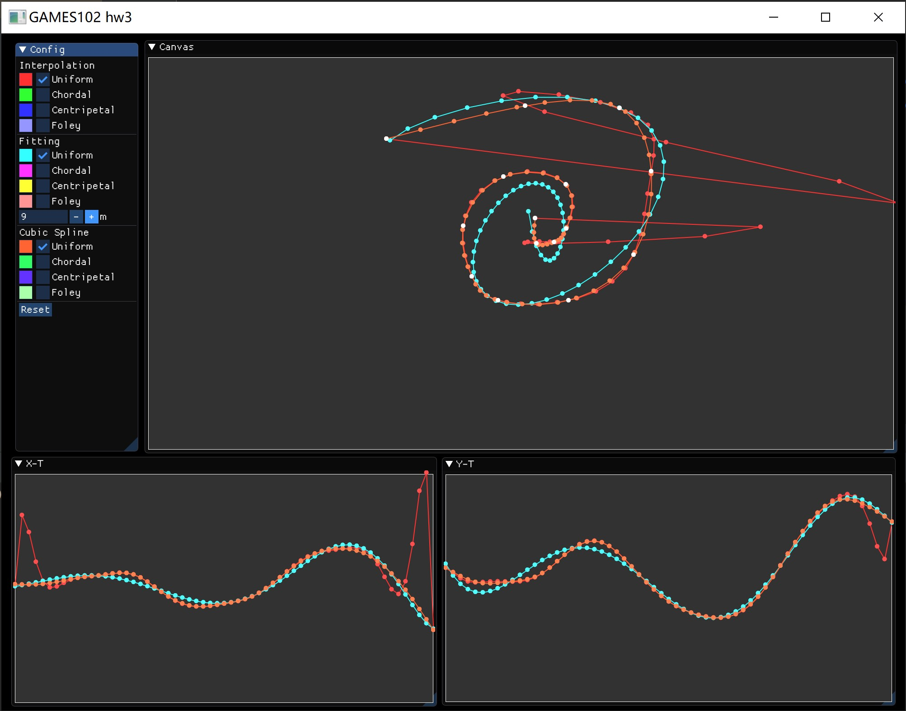
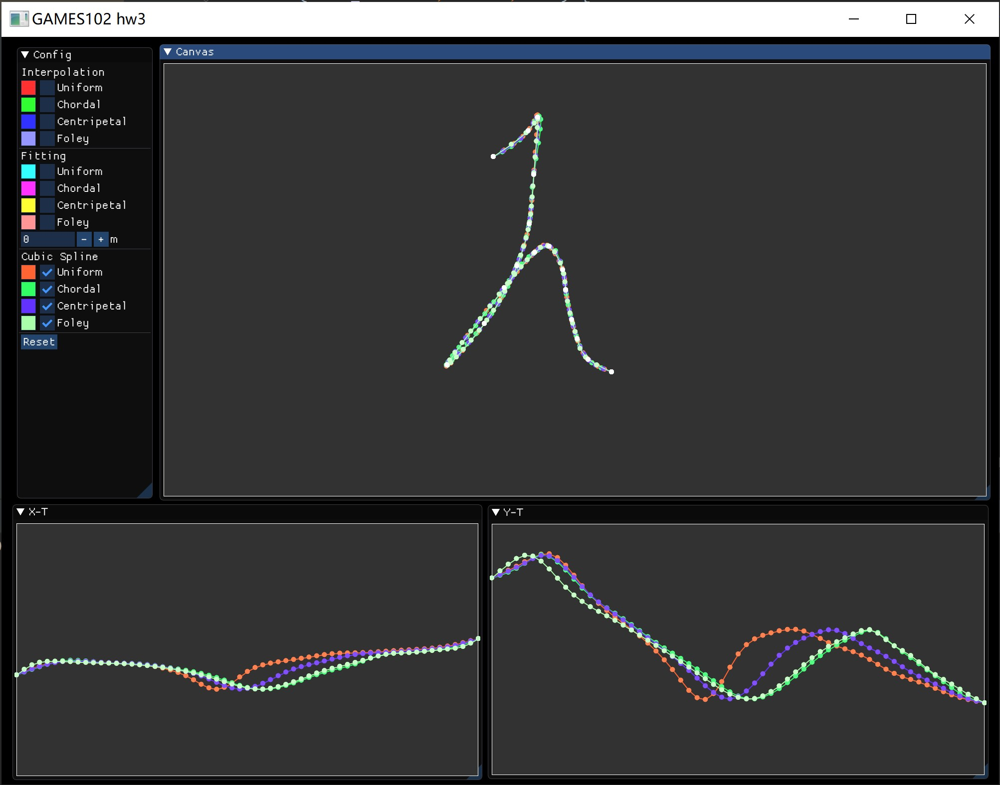
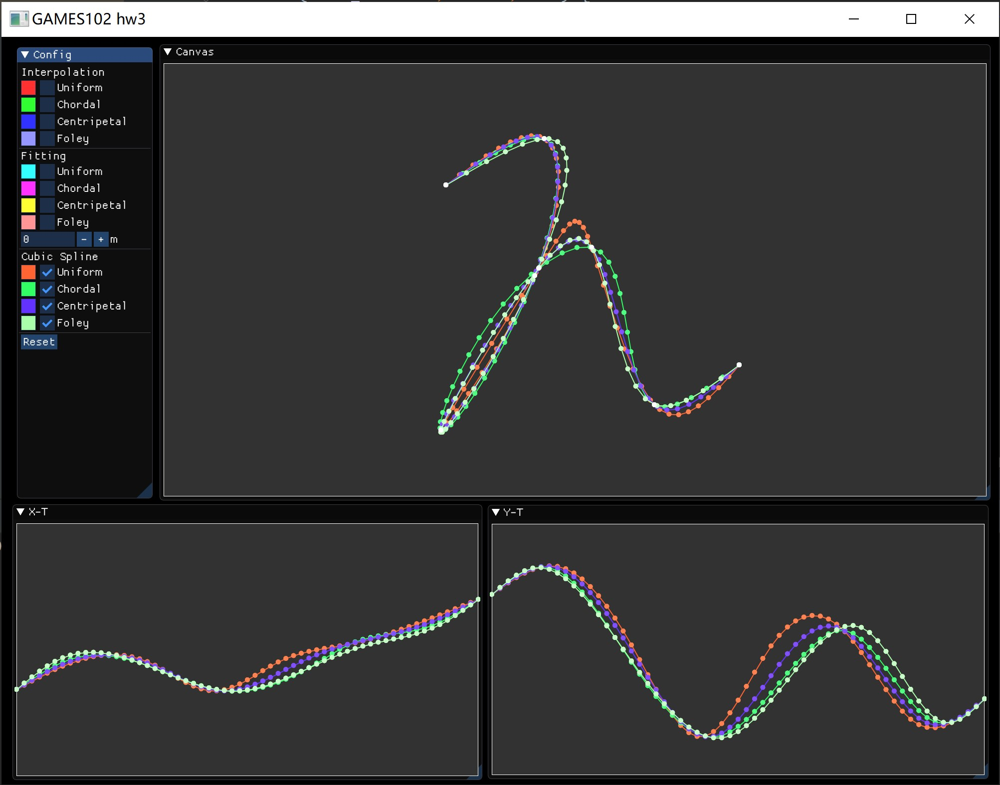
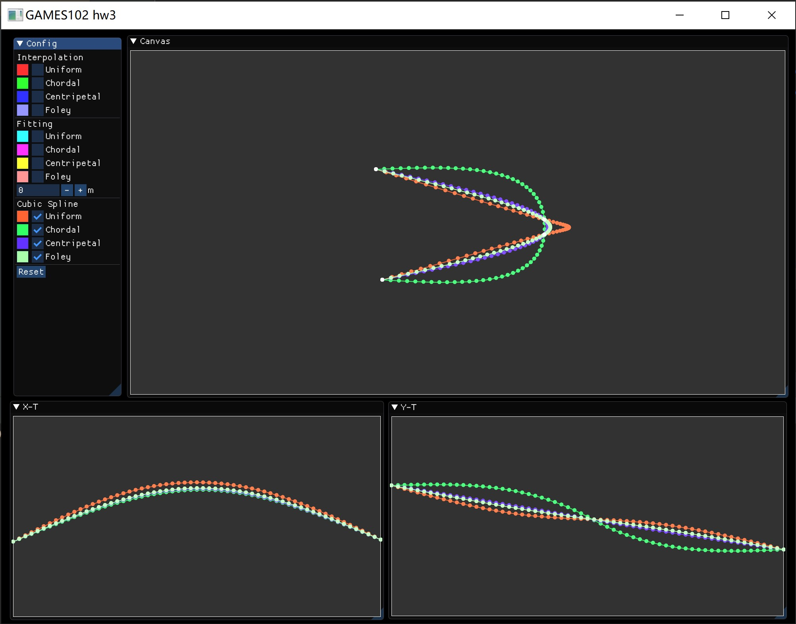
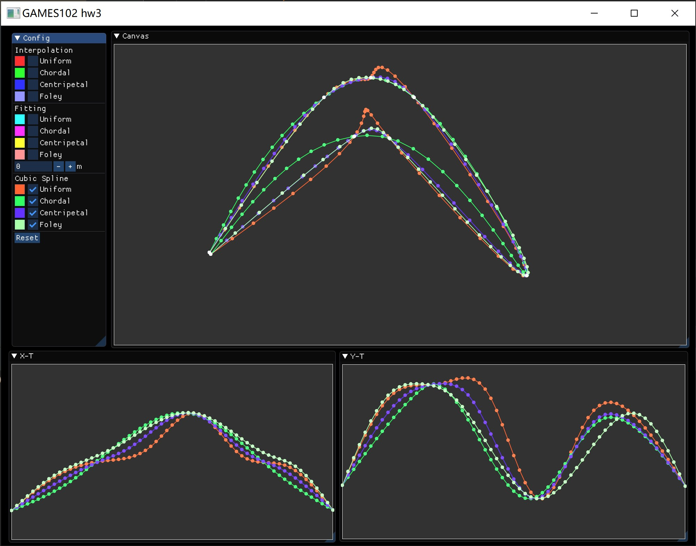
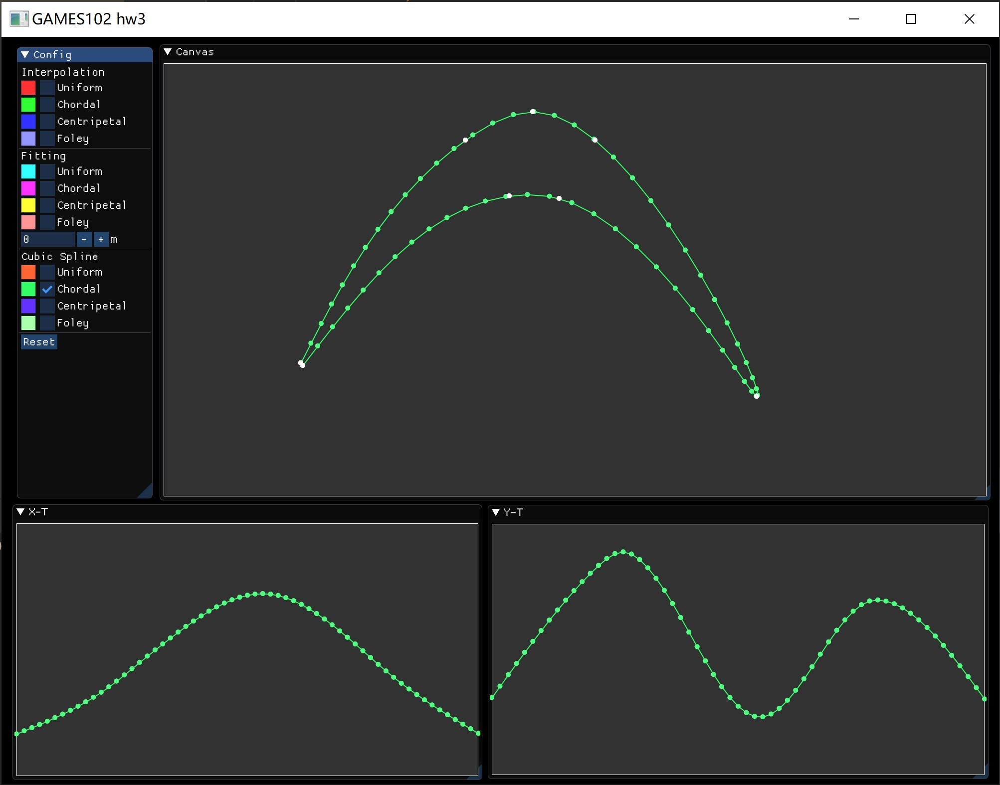
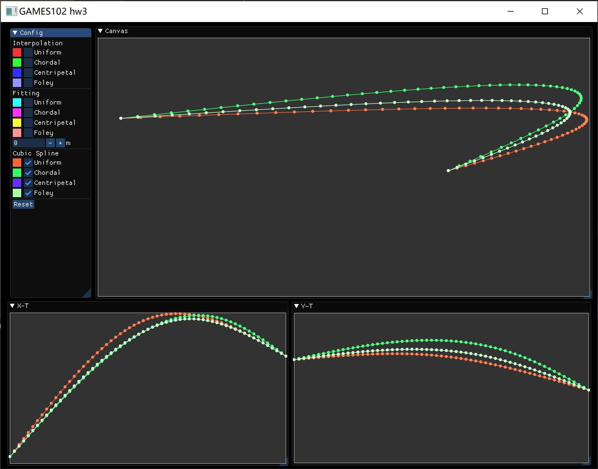
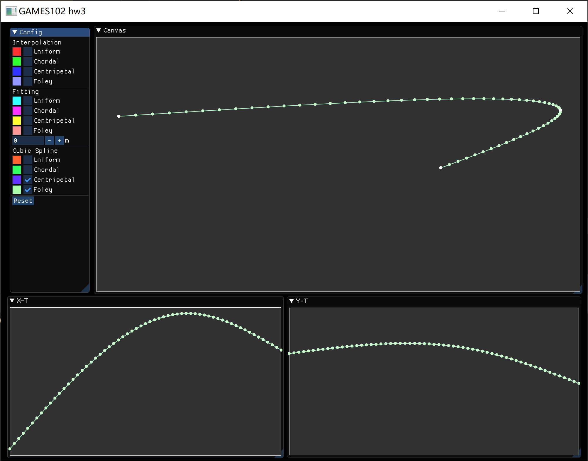

# GAMES 102 hw3

陈昱文（浙江大学 - 计算机科学与技术）

## 程序说明

### 使用说明

在右侧的大画布上，鼠标左键点击可以新增一个点，在一个点的附近点击鼠标右键可以删除该点。下方的两个画布则会显示 x 坐标与参数 t 的函数、y 坐标与参数 t 的函数。

在左侧可以勾选控结果是否显示，会用不同的颜色来显示不同结果。

### 使用外部库

（未使用 Utopia）

* glfw（CPM）
* Eigen（CPM）
* glad
* Dear ImGUI

## 原理

### Uniform Parameterization

样本点的参数值均匀分布。如有 $N$ 个样本点，那么第 $i$ 个点的参数值为
$$
t_i = \frac{1}{N - 1}
$$

### Chordal Parameterization

相邻样本点间的参数值差正比于它们之间的距离（弦长）。即：
$$
t_i - t_{i - 1} \propto \lVert \mathbf{p}_i - \mathbf{p}_{i - 1} \rVert
$$

### Centripetal Parameterization

相邻样本点间的参数值差正比于它们之间的距离（弦长）的根号。即：
$$
t_i - t_{i - 1} \propto \sqrt{ \lVert \mathbf{p}_i - \mathbf{p}_{i - 1} \rVert }
$$

### Foley Parameterization

相邻样本点间的参数值不仅与它们之间的距离有关，还与这两个点处样本点连线形成的角的角度有关。即：
$$
t_i - t_{i - 1} \propto \lVert \mathbf{p}_i - \mathbf{p}_{i - 1} \rVert \left( 1 + \frac{3}{2} \frac{\hat{\alpha}_{i - 1} \lVert \mathbf{p}_{i - 1} - \mathbf{p}_{i - 2} \rVert}{\lVert \mathbf{p}_{i - 1} - \mathbf{p}_{i - 2} \rVert + \lVert \mathbf{p}_i - \mathbf{p}_{i - 1} \rVert} + \frac{3}{2} \frac{\hat{\alpha}_i \lVert \mathbf{p}_{i + 1} - \mathbf{p}_i \rVert}{\lVert \mathbf{p}_{i + 1} - \mathbf{p}_i \rVert + \lVert \mathbf{p}_i - \mathbf{p}_{i - 1} \rVert} \right) \\
\hat{\alpha}_i = \min(\pi - \alpha_i, \frac{\pi}{2}) \\
\alpha_i = \mathrm{angle}(\mathbf{p}_{i - 1}, \mathbf{p}_i, \mathbf{p}_{i + 1})
$$
在两个端点，为了能够使用如上公式，可以在两端再增加两个控制点，或者认为对应的项为 0（相当于控制点与端点重合），程序中选择了后者。

## 运行结果

（4 种参数化方法和 3 种插值/拟合方法，组合可以有 12 种结果）

1）10 个样本点排成螺旋形，都使用均匀参数化，使用 3 中插值/拟合方法。

在下侧的两个函数图中，红色的拉格朗日插值只在边界处表现出了明显的龙格现象，但在曲线的图上产生了非常明显的效果。蓝色的多项式拟合的结果没有产生龙格现象，但毕竟是拟合，不会过插值点。橙色的三次样条曲线插值既经过了所有的采样点，也有着更稳定的结果。所以在之后的对比中，都将使用三次样条曲线插值。

2）相似的图形，但使用不同的采样点数。

上图有着更多更密的采样点数，4 种参数化的结果都相差不大。下图使用了更少的采样点，4 种结果产生了较大的差别。

所以之后的对比会使用较少的采样点数来观察几种参数化方法的结果。

3）使用三次样条插值和 4 种参数化方法，样本点有 4 个，其中中间两点间距离近，离另外两点较远。

橙色的均匀参数化因为在中间两点间的参数值的差和两侧的参数值的差相等，在中间两点有更长的长度，向右突出了很长一段。绿色的弦长参数化明显地“胖”了出来，而蓝色的向心参数化因为削弱了弦长的影响，只是微微地“胖”出了一点。浅绿色的 Foley 参数化的结果和向心参数化的结果非常相似。

4）

使用 8 个点形成一个类似回旋镖的形状。均匀参数化出现了奇怪的突起。Foley 参数化与向心参数化的结果相差不大，弦长参数化相比前二者在大部分位置上有着更大的曲率。在这里，我们可能更希望使用弦长参数化的结果。

5）

使用 3 个采样点。Foley 参数化与向心参数化的结果几乎完全重合，曲线曲率最大处在中间的采样点附件，而弦长参数化和均匀参数的曲线曲率最大处则偏在别处。在这里，我们可能更希望使用 Foley 参数化或向心参数化的结果。

## 一些发现与总结

在只有 3 个采样点时，Foley 参数化与向心参数化的结果经常几乎完全重合。

均匀参数化的结果与 Foley 参数化/向心参数化的结果对比，在后二者曲率小的地方有着更大的曲率，而在后二者曲率大的地方有着更小的曲率，即均匀参数化的结果的曲率变化相比要更小一些。

对于 Foley 参数化，我个人的一点感性的理解是：当连续的几个采样点在同一条直线上时，参数值差正比于弦长显然很合理，而刚刚的对比 3 的结果告诉我们，在弯曲的时候，弦长的影响小一些可能会更合理一点，所以 Foley 参数化引入了角度来在不同的情况下都能有比较合理的结果。